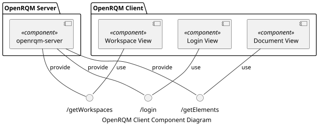

# OpenRQM Client Architecture

## Content

- [OpenRQM Client Architecture](#openrqm-client-architecture)
  - [Content](#content)
  - [Overview](#overview)
  - [License](#license)
  - [Copyright](#copyright)

## Overview

The OpenRQM client consists of 3 major views.

1. Login View - For displaying the login screen
2. Workspace View - For displaying all workspaces and their documents
3. Document View - For displaying the elements of a document 

Each of the views pulls the data related to it from the openrqm-server application via a REST interface as JSON strings.

The REST endpoints are described in more detail in the openrqm-server documentation.

## License

SPDX-License-Identifier: GPL-2.0-only

## Copyright

Copyright (C) 2019 Benjamin Schilling