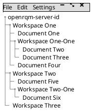
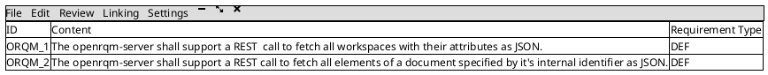

# OpenRQM Client Wireframes

This file shows all the major screens of the OpenRQM Client as wireframes.

## Login View

```plantuml
@startuml
scale max 650 width

@startsalt
{
  Login    | "Username  "
  Password | "****      "
  [Cancel  <&circle-x>] | [  OK  <&account-login> ]
}
@endsalt
@enduml
```

## Workspace View

## Document View

## Linking View

t.b.d.

## Review View

t.b.d.

## Settings View

```puml

scale max 650 width

@startsalt
{
{* Settings }
{#
ID | Content | Requirement Type

}
}
@endsalt
```

## License

SPDX-License-Identifier: GPL-2.0-only

## Copyright

Copyright (C) 2019 Benjamin Schilling